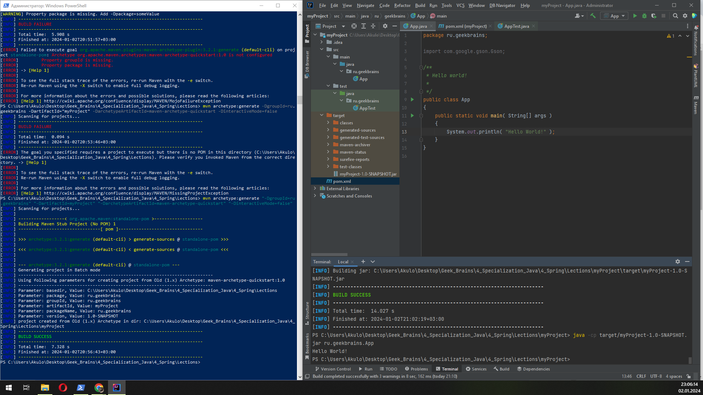

Задание выполнил пошагово по материалам лекции, скрин прилагаю. 
Единственные сложности возникли при генерации проекта через терминал windows, оказалось, 
что в отличие от примера лекции, все groupId, artifactId и прочее необходимо было заключать в кавычки, 
иначе сборка падала. Гугл помог =)

