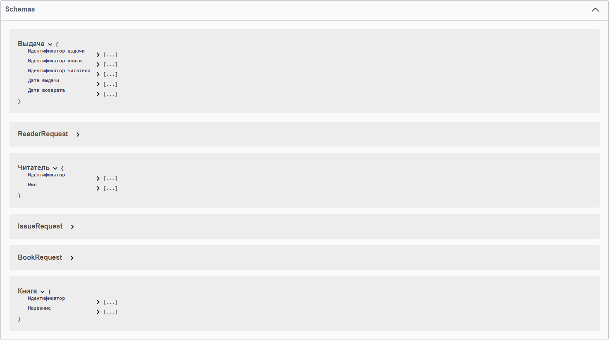

## Скриншоты страницы swagger (с ручками):

### Issuance
.png)
.png)
.png)
.png)
### Reader
.png)
.png)
.png)
.png)
.png)
### Book
.png)
.png)
.png)
.png)
### UI
.png)
.png)
.png)
.png)
.png)
### Schemas
